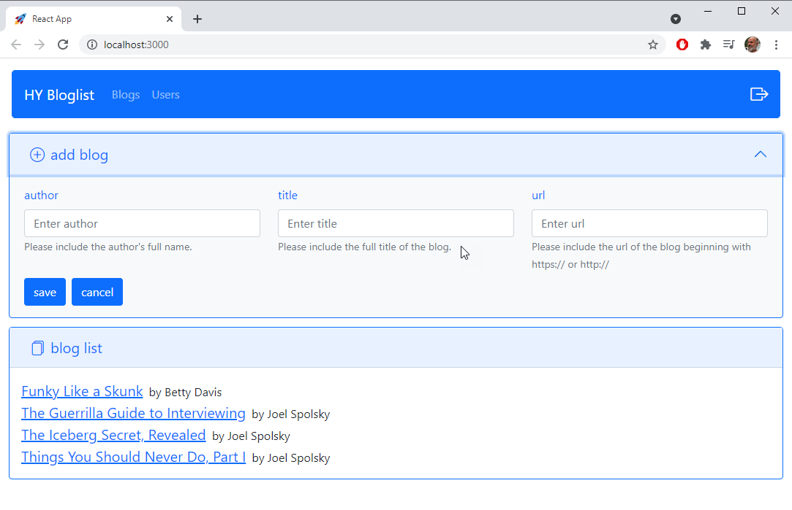
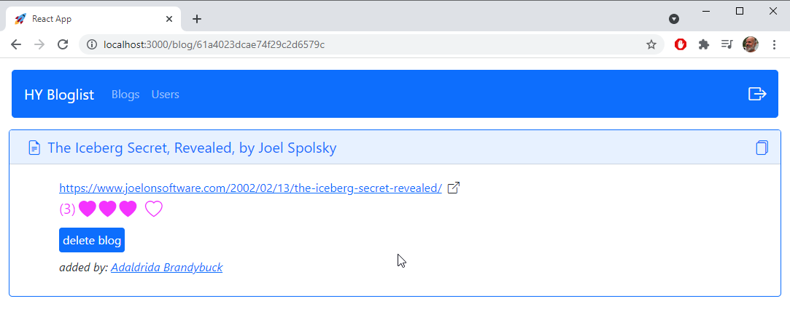

# HY2021 Blog Frontend

Blog application from the Helsinki Full Stack course. This repo contains both frontend and backend. Technologies include:
- React (hooks)
- Redux
- React Router
- React-Bootstrap
- Jest
- Express
- Mongoose
- Cypress





## Initial Setup

### Configuration 
To configure this application, provide the following files in the root of the repo:
- .env
- .env.api
- .env.test.api

The contents of these files should be as follows:

**.env**
```
port=3000
```
**.env.api**
```
PORT=4000
MONGODB_URI=<url to mongodb>
JWT_SIGNATURE=<any secret string for signing tokens>
```
**.env.test.api**
```
PORT=4000
MONGODB_URI=<url to mongodb>
JWT_SIGNATURE=<any secret string for signing tokens>
```

.env.api and .env.test.api can refer to different databases. The database in env.test.api is reset to test baseline each time a Cypress test runs.

### Windows NPM Shell Override
The scripts in package.json all use unix-style commands without cross-env. On Windows, please tell npm to use git bash by providing an **.npmrc** file in the root of the repo.

**.npmrc**
```
script-shell = "C:\\Program Files\\Git\\bin\\bash.exe"
```

## Available Scripts

In the repo root, you can run:

### `yarn api`

Runs the backend API in development mode on port 4000. The MongoDB is on Atlas.

### `yarn api:cypress`

Runs the backend API in development mode on port 4000 using a different database on Atlas. 
Cypress reseeds the database before each test, so this can be used to prevent manual test data from being overwritten.

### `yarn start`

Runs the app in the development mode on port 3000. 
The page will reload if you make edits. 

### `yarn test:api`

Runs the suite of Jest tests for the API. 

### `yarn test:react`

Runs the suite of Jest tests for the React frontend. 

### `yarn cypress`

Opens the Cypress runner from which you can run integration tests.

Before running Cypress, the API and frontend must both be running. Start them with the following comands:
```
yarn api:cypress
yarn start
```

### 

### `yarn build`

Builds the app for production to the `dist` folder.

NOTE: The API, when not in production, serves the 'dist' folder as static content at the root of the application (the REST endpoints are all under /api). 
Because of this, the built code can be tested by running the api and navigating to the root URL at that port.

